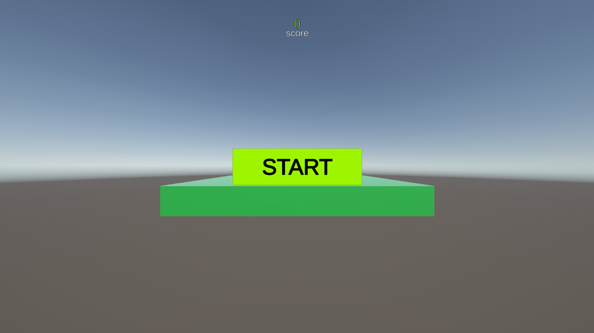
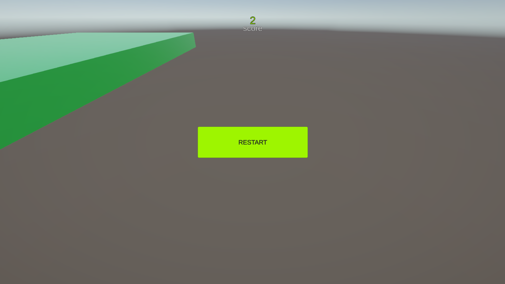

Doofus Jump – Unity WebGL Game

A fun and challenging WebGL platform survival game where you control Doofus, jumping across floating pulpits while the ground disappears beneath you. Your goal? Stay alive as long as possible, stack up score points, and avoid falling into the abyss!

Play the game online 👉 [Play Here](https://abhishekbapna51.github.io/HW_2025_TEST/)

🚀 Game Features
🟢 Start Screen – Game begins only after you click START
🔁 Restartable Game Loop – After falling, you can instantly restart and play again
🎵 Background Music – Starts on play, stops on game over / restart
📈 Score System – Score increases as you survive longer
⚡ Real-time Movement – Smooth player controller using physics
🕳️ Game Over Detection – Detects fall via Y-threshold & optional death-plane
📱 WebGL Compatible – Runs directly in browser
🎨 Clean UI – Designed using Unity UI Toolkit + TextMeshPro

🎛️ Player Controls
Key	Action
W / Up Arrow	Move Forward
S / Down Arrow	Move Backward
A / Left Arrow	Move Left
D / Right Arrow	Move Right

🧠 Core Systems Overview

🔹 1. UI Manager
Handles:
Start Screen
Game Over Screen
Restart logic
Background music
Score reset
Fully persistent across scene reloads.

🔹 2. GameStateManager
Controls:
Game states (Running, GameOver)
Pause/Resume (Time.timeScale)
Scene restart

🔹 3. FallGameOver
Triggers game over when:
Doofus Y position ≤ threshold
OR entering death-plane trigger
Disables movement & Rigidbody before calling GameOver().

🔹 4. DoofusMovement
Uses Rigidbody physics
Reads movement speed from JSON
Supports inspector override speed
Smooth continuous movement for WebGL

📁 Project Folder Structure
Assets/
│── Scripts/
│   ├── DoofusMovement.cs
│   ├── FallGameOver.cs
│   ├── GameStateManager.cs
│   ├── UIManager.cs
│   ├── ScoreManager.cs
│   └── PulpitSpawner.cs
│
│── Prefabs/
│── Scenes/
│── Materials/
│── music/
│── GameConfig/

🛠️ How to Build & Deploy (WebGL)
✔ 1. Switch to WebGL Platform
File → Build Profiles → Platform → Web → Switch Platform

✔ 2. Build WebGL Folder
File → Build And Run

Unity generates:
/Build/WebBuild/
    ├── index.html
    ├── WebBuild.data
    ├── WebBuild.framework.js
    ├── WebBuild.wasm

🎵 Music System

Background music starts ONLY after pressing START
Stops on:
Game Over
Restart
Returning to Start Screen
Prevented from playing on awake unless manually started
Uses a persistent AudioSource auto-bound by UIManager.

🧪 Testing Checklist
✔ Start screen visible on load
✔ Game paused until pressing START
✔ Music starts on play
✔ Score increases as expected
✔ Game Over triggers when Doofus falls
✔ Restart reloads scene & UI resets
✔ Restart works infinite times
✔ WebGL build loads without compression errors

🖼️ Screenshots

🖼️ Demo video

👨‍💻 Developed by:
Abhishek Bapna (22BCE3195)
VIT vellore
bapnaabhishek51@gmail.com

⭐ Support
If you like the project, feel free to ⭐ star the repository!
Have issues or ideas? Create an Issue or contact me.